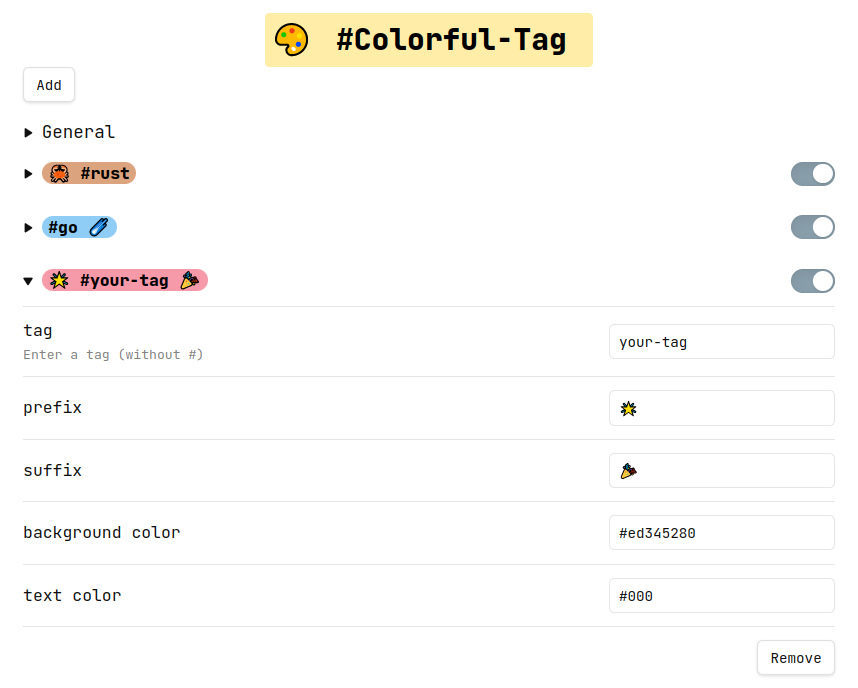

# Obsidian Colorful Tag

This is a sample plugin for [Obsidian](https://obsidian.md).

You can easily add prefix or suffix to a tag and change the tag’s background or text color.

## Features

- Add prefix or suffix to a tag
- Change the text size or text color
- Change the tag's radius size or tag’s background color
- Global setting or per tag setting

## How To Install

You can install this plugin via [BRAT](https://github.com/TfTHacker/obsidian42-brat) now.

Here is the repository for this plugin: `rien7/obsidian-colorful-tag`

## Inspired By

- [Shimmering Focus ⟡](https://github.com/chrisgrieser/shimmering-focus): A minimalistic and opinionated Obsidian theme for the keyboard-centric user.
- [Supercharged Links](https://github.com/mdelobelle/obsidian_supercharged_links): Adds attributes to internal links with the values of target note's frontmatter attributes.